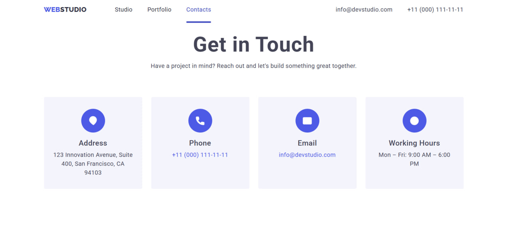

# WebStudio

A responsive multi-page website for a design studio, built from a Figma design using semantic HTML, modular SCSS (BEM methodology), and vanilla JavaScript.

**Design reference:** [Figma — Web Studio (Version 3.0)](https://www.figma.com/file/B1m2uk25m1eAgroESAuM2g/Web-Studio-(Version-3.0)?type=design&node-id=297046-1554&mode=design)

## Pages

| Studio | Portfolio | Contacts |
|---|---|---|
|  |  |  |

## Tech Stack

- HTML5 — semantic markup
- SCSS — BEM methodology, nested selectors, modular structure via `@use`
- JavaScript (Vanilla) — no frameworks or libraries
- Responsive design — breakpoints for desktop, tablet (1179px), and mobile (767px)

## Features

- Burger menu with fullscreen mobile navigation
- Modal contact form built on the native `<dialog>` element
- Client-side form validation (modal and Contacts page)
- Category filtering for portfolio projects
- Hover overlay with project description on portfolio cards
- Embedded map on the Contacts page

## Project Structure

```
src/
├── index.html
├── portfolio.html
├── contacts.html
├── fonts/
├── icons/
│   ├── customers/
│   ├── features/
│   ├── form/
│   ├── socials/
│   └── ui/
├── images/
│   ├── hero/
│   ├── portfolio/
│   ├── portfolio-preview/
│   └── team/
├── scripts/
│   ├── components/       # modal.js, mobile-menu.js
│   └── pages/            # contacts-form.js, portfolio-filter.js
└── styles/
    ├── main.scss
    ├── _variables.scss
    ├── _globals.scss
    ├── _normalize.scss
    ├── _fonts.scss
    └── blocks/
        ├── components/    # button, input, modal, mobile-menu, section
        ├── layout/        # header, footer
        └── pages/         # hero, features, team, customers, portfolio...
```

## Running the Project

No build step is required to view the site — open `src/index.html` directly in a browser or serve it with Live Server.

For SCSS development, compile the stylesheets with:

```
sass --watch src/styles/main.scss src/styles/main.css
```

## License

This project is licensed under the [MIT License](LICENSE).
